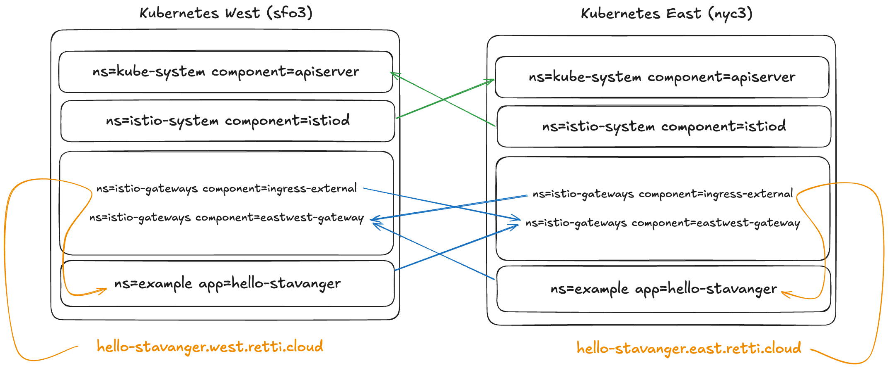

# istio-multicluster-demo

This repository contains a demo setup for Istio multicluster (multi-primary with two networks). The setup includes:
- Two different clusters (`east` and `west`) in different regions
- Istio 1.27 installed in both clusters (sidecar mode)
  - External ingress in both clusters
  - East-west gateway in both clusters
- Components
  - An example app
  - cert-manager
  - [skiperator](https://github.com/kartverket/skiperator)

# Architecture

## Prerequisites
- A privileged DigitalOcean token exposed as `DIGITALOCEAN_TOKEN` environment variable

## References
["Vi bygde et hybridmesh. Det var vakkert. Det var unødvendig."](https://www.hellostavanger.no/talks/918061)
by [Bård Ove Hoel](https://github.com/BardOve) and [Even Holthe](https://github.com/evenh) (Hello Stavanger 2025)
